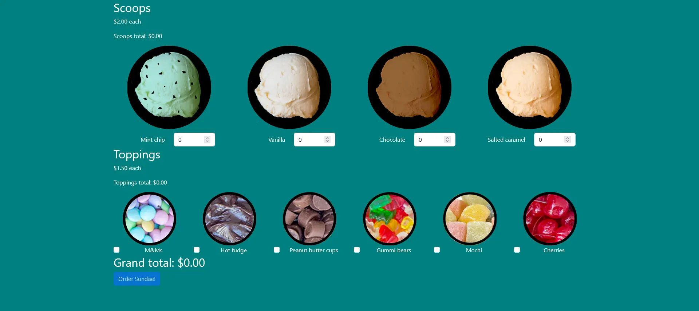

<!-- ===== HEADER ===== -->
<p align="right">
  <a href="./README.md" title="Read the README in english">
    
  </a>
  
</p>

<h1 align="center">
  <a
    href="https://guipmdev-sundaes-on-demand.vercel.app/"
    title="Acessar a aplicação web"
  >
    sundaes-on-demand
  </a>
</h1>

<p align="center">
  
  
  <a
    href="https://github.com/guipmdev/sundaes-on-demand/actions/workflows/node.js.yml"
    title="Visualizar execuções do workflow do GitHub"
  >
    
  </a>
  
  
  <a href="./LICENSE" title="Visualizar licença do projeto">
    
  </a>
  <a href="https://bonnie.dev/" title="Acessar o site da Bonnie">
    
  </a>
</p>



<p align="center">
  <a href="https://guipmdev-sundaes-on-demand.vercel.app/"
    >Acessar a aplicação web ↗</a
  >
</p>

<details>
  <summary>
    <h2>📒 Índice</h2>
  </summary>

- [📍 Visão geral](#-visão-geral)
  - [⚠️ Aviso](#️-aviso)
- [✨ Funcionalidades](#-funcionalidades)
- [🤖 Demo](#-demo)
- [🛠 Tecnologias](#-tecnologias)
  - [Website](#website)
  - [Servidor](#servidor)
  - [Úteis](#úteis)
- [🚀 Primeiros passos](#-primeiros-passos)
  - [✔️ Pré-requisitos](#️-pré-requisitos)
  - [📦 Instalação](#-instalação)
  - [⚙️ Utilização](#️-utilização)
  - [🧪 Executando testes](#-executando-testes)
- [📄 Licença](#-licença)
- [👏 Reconhecimentos](#-reconhecimentos)
</details>

<!-- ===== PROJECT INFOS ===== -->

## 📍 Visão geral

O projeto **sundaes-on-demand** é uma aplicação web desenvolvida em _React_ para pedir sundaes personalizados, permitindo escolher dentre diferentes sabores e coberturas. O aplicativo calcula o preço total com base nas seleções e fornece uma interface amigável para o envio dos pedidos.

Esse projeto atende ao setor de lojas de sobremesas, simplificando o processo de pedidos on-line e proporcionando uma experiência interativa e personalizável para os clientes.

### ⚠️ Aviso

O back-end dessa aplicação foi desenvolvido com _Node.js_ e não tem um deploy, pois o foco principal é os testes. **Para testar essa aplicação completamente, você precisará clonar o repositório**, executar o script `start` e, em seguida, abrir o site.

## ✨ Funcionalidades

🍨 **Monte sundaes** escolhendo dentre os diversos sabores e coberturas

🛵 **Confirme o seu pedido** e aguarde ele chegar _(apenas simbólico)_

🧪 Projeto **focado em testes** Jest e Testing Library

## 🤖 Demo

https://github.com/guipmdev/sundaes-on-demand/assets/136738335/c3f663ac-a3e4-4a12-8cd1-b8915e12e165

## 🛠 Tecnologias

As seguintes ferramentas foram usadas para desenvolver esse projeto:

### Website

<p>
  <a href="https://react.dev/">
    
  </a>
  <a href="https://eslint.org/">
    
  </a>
</p>

<p>
  <a href="https://jestjs.io/">
    
  </a>
  <a href="https://www.npmjs.com/package/jest-junit">
    
  </a>
  <a href="https://testing-library.com/">
    
  </a>
  <a href="https://mswjs.io/">
    
  </a>
</p>

<p>
  <a href="https://axios-http.com/">
    
  </a>
</p>

<p>
  <a href="https://getbootstrap.com/">
    
  </a>
  <a href="https://react-bootstrap.netlify.app/">
    
  </a>
</p>

_\* Confira o arquivo [<kbd>package.json</kbd>](./package.json)_

### Servidor

<p>
  <a href="https://nodejs.org/">
    
  </a>
  <a href="https://nodejs.org/">
    
  </a>
  <a href="https://github.com/expressjs/cors">
    
  </a>
</p>

<p>
  <a href="https://jestjs.io/">
    
  </a>
  <a href="https://github.com/ladjs/supertest">
    
  </a>
</p>

<p>
  <a href="https://github.com/zloirock/core-js">
    
  </a>
</p>

### Úteis

<p>
  <a href="https://git-scm.com/">
    
  </a>
  <a href="https://nodejs.org/">
    
  </a>
  <a href="https://code.visualstudio.com/">
    
  </a>
</p>

## 🚀 Primeiros passos

### ✔️ Pré-requisitos

Antes de você começar, certifique-se que você tem as seguintes ferramentas instaladas na sua máquina: [Git](https://git-scm.com/downloads), [Node.js](https://nodejs.org/en/download). Também é bom ter um editor para trabalhar com o código, como o [VSCode](https://code.visualstudio.com/Download).

### 📦 Instalação

1. Clone o [repositório do backend](https://github.com/guipmdev/sundae-server/):

```sh
git clone https://github.com/guipmdev/sundae-server/
```

2. Mude para o diretório do backend:

```sh
cd sundae-server
```

3. Instale as dependências:

```sh
npm install
```

4. Volte e clone o repositório do projeto:

```sh
cd ..

git clone https://github.com/guipmdev/sundaes-on-demand/
```

5. Mude para o diretório do projeto:

```sh
cd sundaes-on-demand
```

6. Instale as dependências:

```sh
npm install
```

### ⚙️ Utilização

1. Entre no diretório do backend:

```sh
cd sundae-server
```

2. Inicie o servidor:

```sh
npm run start
```

3. Mude para o diretório do projeto:

```sh
cd ../sundaes-on-demand
```

4. Inicie a aplicação web:

```sh
npm run start
```

5. Acesse https://localhost:3000/ (ou https://guipmdev-sundaes-on-demand.vercel.app/) para visualizar a aplicação

### 🧪 Executando testes

```sh
npm run test
```

## 📄 Licença

Este projeto está licenciado de acordo com os termos da licença `MIT`. Consulte o arquivo [LICENSE](./LICENSE) para mais informações.

## 👏 Reconhecimentos

> - Muito obrigado à [Bonnie Schulkin](https://bonnie.dev/) pelo layout e pelas dicas de como montar este projeto

<!-- ===== FOOTER ===== -->

---

<p align="center">
  Feito com 💙 por
  <a href="https://www.guipm.dev/"> @guipm.dev </a>
  - Fique à vontade para
  <a href="mailto:guipm.dev@gmail.com">entrar em contato comigo</a>!
</p>

<br />

<p align="center">
  <a href="#top">
    <b>↑&nbsp;&nbsp; Voltar ao topo &nbsp;&nbsp;↑</b>
  </a>
</p>
